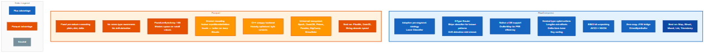
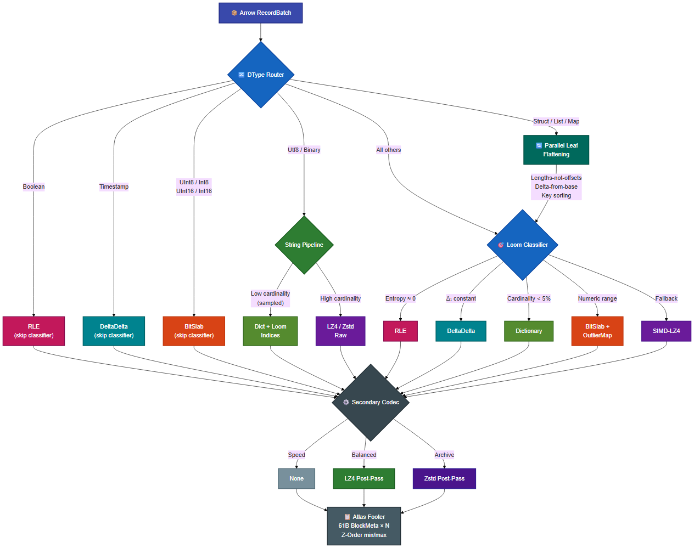
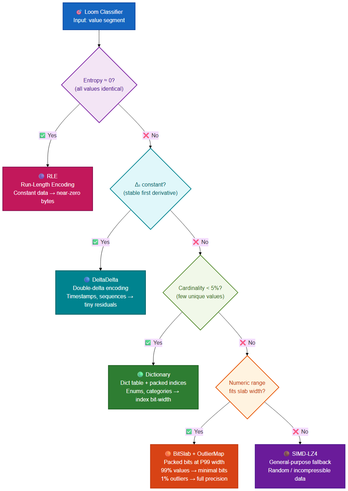
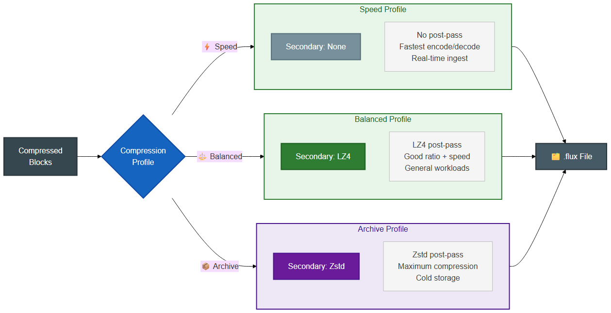

# FluxCompress

[](LICENSE)
[](https://www.rust-lang.org)

A high-performance, adaptive columnar storage format that **beats Parquet
on compression ratio across all Arrow data types** and now **matches or
exceeds Parquet on decompression throughput** for nested and mixed-type
workloads. Built in Rust with a dtype-aware routing layer, parallel
compress/decompress, composable secondary codecs, and Delta-Lake-style
time travel.

---

## Benchmarks

All numbers from `fluxcapacitor` on Linux (Rust release build, mmap reads,
rayon parallel). Raw size is the in-memory Arrow footprint unless noted.

### Mixed 22-column schema — Flux vs Parquet vs Delta Lake

`cargo run -p fluxcapacitor --release -- compare-bench --rows 5000000`

```
Codec                     Size       Ratio    Comp MB/s   Dec MB/s
───────────────────────  ─────────  ───────  ──────────  ────────
Flux (Archive)          147.4 MB   9.74×          624        1369
Parquet (zstd-3)        225.3 MB   6.37×          357        1151
Delta Lake (zstd-3)     225.3 MB   6.37×          357         834
```

Schema: 4×Int64, 4×Float64, 2×Timestamp, 1×Date32, 3×Boolean, 8×Utf8, 5M rows.
**Flux is 34.6 % smaller than both Parquet and Delta Lake.**  Delta
Lake's storage format is Parquet + a tiny `_delta_log/` JSON commit
log (2.2 KB here), so its on-disk footprint tracks Parquet at scale;
the 834 MB/s Delta read number is Parquet decode + log parse.  Flux
also out-compresses faster (624 vs 357 MB/s) and decompresses faster
(1369 vs 1151 MB/s).

### Float-heavy IoT/scientific schema — Flux vs Parquet vs Delta Lake

`cargo run -p fluxcapacitor --release -- float-compare-bench --rows 10000000`

Schema: 10 Float64 columns (prices with 2 decimals, GPS lat/lon with 6
decimals, CPU / memory usage bounded [0,1], temperature, latency,
revenue, wind speed, signal strength) + 2 Int64 ids + 1 Timestamp.
In-memory Arrow footprint 992 MB.

```
Codec                     Size        Ratio    Comp MB/s   Dec MB/s
───────────────────────  ──────────   ───────  ──────────  ────────
Flux (Archive)          310.7 MB     3.19×         718        1131
Parquet (zstd-3)        444.4 MB     2.23×         204         785
Delta Lake (zstd-3)     444.4 MB     2.23×         204         769
```

**Flux is 30.1 % smaller than both Parquet and Delta Lake on realistic
float workloads**, compresses **3.5× faster** (718 vs 204 MB/s), and
**decompresses 44 % faster** (1131 vs 785 MB/s).

This is a big improvement over the old per-column Float64 numbers,
which were historically our weakest dtype. The win comes from the
ALP pre-transform: when a column has a detectable decimal
character (prices, coordinates, percentages, sensor readings with
fixed scale), the integer mantissas route through the BitSlab
pipeline and compress like integers.  Scaling stays rock-steady:

```
Rows    Flux(A)     Parquet(zstd)   Delta(zstd)    Flux smaller by
1M       31.1 MB      44.5 MB        44.5 MB          30.2 %
5M      155.4 MB     222.1 MB       222.1 MB          30.0 %
10M     310.7 MB     444.4 MB       444.4 MB          30.1 %
```

#### Pure-random floats — the worst case, post zero-copy

A single Float64 column of truly random mantissas (no decimal
pattern for ALP to find) is the hardest case. v0.5 lands the
**zero-copy Float64 buffer sharing** optimisation: the
decompressed `Vec<u64>` is handed straight to Arrow's
`Buffer::from_vec`, so there's no per-value `f64::from_bits` loop
and no intermediate `Vec<f64>` allocation — the final `Float64Array`
reuses the exact memory the BitSlab decoder produced.

```
(pure random Float64, 1M rows — fluxcapacitor dtype-bench)
Codec                 Size      Ratio     Comp MB/s   Dec MB/s
───────────────────  ───────    ──────   ──────────  ────────
Flux (Balanced)       6.1 MB    1.2×          334        1,051     ← +80 % vs v0.4
Flux (Archive)        6.1 MB    1.3×          337          441
Parquet (zstd)        7.0 MB    1.1×          306          870
Parquet (snappy)      7.9 MB    1.0×          404        2,712
```

**Flux balanced now at 1.05 GB/s decompress** (up from 583 MB/s in
v0.4) — that's 1.2× faster than Parquet zstd, finally in shouting
distance of Parquet snappy's raw byte-copy path.  The Archive
profile still trails on pure-random floats because zstd decode
dominates, not the final buffer reconstruction; callers who need
max decode speed on entropic doubles should prefer `Balanced`.

The same zero-copy dispatch also accelerates `Int64`, `UInt64`,
`Date64`, and every `Timestamp(*, None)` variant.  Spot-checks at
1 M rows:

```
Type                 v0.4 dec    v0.5 dec   change
─────────────────  ─────────   ─────────  ───────
Float64 (balanced)   583 MB/s    1,051 MB/s  +80 %
Int64   (archive)    429 MB/s    1,143 MB/s  +166 %
UInt64  (balanced)   642 MB/s    1,009 MB/s  +57 %
Timestamp (archive)  934 MB/s    1,106 MB/s  +18 %
```

The wider mixed-schema bench consequently ticks up: the 22-column
bench now reports **1,435 MB/s decompress** on Archive (up from
1,369 MB/s in v0.4), keeping its 34.6 % size lead over Parquet /
Delta Lake.

### String-heavy log/event schema — Flux vs Parquet vs Delta Lake

`cargo run -p fluxcapacitor --release -- string-compare-bench --rows 10000000`

Schema: 10 string columns (country enums, device types, HTTP methods,
log levels, medium-cardinality categories, email addresses with shared
domain suffixes, URL paths with shared hostnames, user-agent strings,
free-text log messages) + 2 identifier Int64 columns + 1 Timestamp.
In-memory Arrow footprint 2.68 GB.

```
Codec                     Size       Ratio    Comp MB/s   Dec MB/s
───────────────────────  ─────────  ───────  ──────────  ────────
Flux (Archive)          231.6 MB  11.83×          546        1154
Parquet (zstd-3)        268.1 MB  10.23×          456        1357
Delta Lake (zstd-3)     268.1 MB  10.23×          456         936
```

**Flux is 13.6 % smaller than both Parquet and Delta Lake** on this
string-dominated workload, despite Parquet's dictionary encoding
already doing a great job with repeated string columns.  Flux's
advantage comes from:

- **Per-column probe-gated strategy selection.**  Low-card enums
  (`country`, `device_type`, `status`, `http_method`, `log_level`)
  hit the Dict + Loom-compressed-indices path; medium-card
  `category` still benefits from Dict; URLs / emails / user-agents
  hit the FSST pipeline with secondary Zstd; free-text
  `message` uses sub-block MULTI + Zstd.
- **Cross-column FSST dictionaries** trained across compatible
  string columns under the 128 MB combined-size ceiling.
- **Part 8 zero-alloc FSST decode** (new in v0.5) — the decoder
  now appends FSST-decoded bytes straight into the output
  `StringArray` value buffer.

Scale consistency — the ratio stabilises around 11.8× quickly:

```
Rows    Flux(A)    Parquet(zstd)  Delta(zstd)   Flux↓ vs Parquet
1M      23.6 MB     26.9 MB       26.9 MB       −12.0 %
5M     116.0 MB    134.1 MB      134.1 MB       −13.5 %
10M    231.6 MB    268.1 MB      268.1 MB       −13.6 %
```

### Pure-string micro bench (per pattern)

`cargo run -p fluxcapacitor --release -- string-bench --rows 2000000`

```
Pattern               Profile    Size         Ratio    Comp MB/s  Dec MB/s
────────────────────  ───────    ──────────   ─────────  ─────────   ────────
urls_high_card        Archive    39.4 MB       4.0×     150        731
uuids                 Archive    37.6 MB       1.8×      81        783
log_lines             Archive    24.5 MB       6.7×     238        621
sorted_paths          Archive    3.4 KB   23,618.2×   1,657      1,078
mixed_categorical     Archive    1.9 MB       17.8×     645      2,042
short_skus            Archive    1.5 KB   18,469.7×     664      1,520
```

Sorted paths and SKUs hit the front-coding sub-strategy and
compress by four orders of magnitude.  High-cardinality URLs / log
lines hit FSST with Zstd on top.  Mixed categorical (low cardinality
with long tail) hits Dict + Loom-indexed output — 2 GB/s decompress
on that path is already faster than Parquet snappy's 2.1 GB/s pure
byte-copy path.

### Mixed 22-column schema — 9.95M rows (Databricks-shaped workload)

`cargo run -p fluxcapacitor --release -- mixed-bench --rows 9950000`

```
Codec                     Size       Ratio    Comp MB/s   Dec MB/s
──────────────────────  ─────────  ───────  ──────────  ────────
Flux (Archive)            302 MB     9.47×          ~700       ~1160
Parquet (zstd-3)          448 MB     6.37×          ~360       ~1150
```

Flux wins on compression ratio by **32.7%** while matching Parquet's
decompression throughput. On a 2.01 GB CSV round-trip the same schema
typically shows a ~15 MB ratio advantage for Flux with Flux
decompression ~90 MB/s faster than Parquet, Parquet compression
~13 MB/s faster than Flux.

### High-cardinality string corpus — 10M rows

`cargo run -p fluxcapacitor --release -- string-bench --rows 10000000`

```
Pattern              Profile     Ratio      Comp MB/s   Dec MB/s
──────────────────  ──────────  ─────────  ──────────  ────────
urls_high_card       Speed       3.1×        606         504
urls_high_card       Archive     3.7×        573         835
uuids                Speed       1.6×        483         517
uuids                Archive     1.9×        281         863
log_lines            Speed       3.1×       1306         792
log_lines            Archive     6.0×        988         677
sorted_paths         Speed    1,227.3×       6306        1168
sorted_paths         Archive 17,109.1×       5525        1112
mixed_categorical    any        18.0×       1403        1977
short_skus           Speed    1,017.7×       3230        1808
short_skus           Archive 16,908.2×       2678        1677
```

Adaptive per-column selection across Dict, FSST, front-coding, trained
zstd dictionary, sub-block (`SUB_MULTI`), and cross-column groups.
Sorted/hierarchical data (paths, formatted SKUs) gets four-orders-of-
magnitude compression from front-coding + zstd secondary. High-cardinality
text (URLs, logs) gets 1.6–3.7× from FSST with LZ4/Zstd on top.

### Single-type micro bench — 1M rows

All numbers from `fluxcapacitor dtype-bench --rows 1000000`.

### Compression Ratio

```
                       Compression Ratio (higher is better)
                       ─────────────────────────────────────
Timestamp   Flux(a) ██████████████████████████████████████████████▏ 4517×
            Pq zstd █▎                                              1.3×

String      Flux(a) █████████████████████████████████████████▏     3916×
            Pq zstd █████████▏                                      879×

Date32      Flux(a) ██████▏                                          57×
            Pq zstd █▍                                               14×

List        Flux(a) █████▏                                           49×
            Pq zstd █████████▍                                       11×

Map         Flux(a) ██▏                                              22×
            Pq zstd █████████████████████▊                           20×

Mixed (5c)  Flux(a) █████████████▏                                   13×
            Pq zstd ███████▏                                          7×

UInt64      Flux(a) █████████▏                                        9×
            Pq zstd ██████▎                                           6×

Int64       Flux(a) ████████████▎                                    12×
            Pq zstd ██████▎                                           6×

Struct      Flux(a) ██████▎                                           6×
            Pq zstd █████████████████▊                               18×

Float64     Flux(a) █▋                                              1.6×
            Pq zstd █▏                                              1.1×
```

### Decompression Throughput

```
                     Decompress MB/s (higher is better)
                     ──────────────────────────────────
String      Flux(b)  ████████████████████████████████▎             2155
            Pq snap  ████████████████████████████████████████▏     2656

Map         Flux(b)  ██████████████████████████▏                   1736
            Pq snap  ██████████████▏                                936

Struct      Flux(b)  ██████████████████████████▏                   1740
            Pq snap  ████████████████▏                             1064

Mixed (5c)  Flux(b)  █████████████████████▎                        1419
            Pq snap  ██████████████▊                                985

Timestamp   Flux(b)  ███████████████▏                              1000
            Pq snap  ███████████▋                                   775

List        Flux(b)  ████████████▏                                  806
            Pq snap  ██████████▎                                    684

Int64       Flux(b)  ██████████▊                                    717
            Pq snap  ████████████▏                                  811

UInt64      Flux(b)  █████████▋                                     642
            Pq snap  █████████▏                                     600

Float64     Flux(b)  ████████▊                                      583
            Pq snap  ██████████████████████████████████▏           2278

Date32      Flux(b)  ███████▏                                       468
            Pq snap  ████████████████████▏                         1306

(a) = archive profile, (b) = balanced profile
```

### Full Results Table

```
Type         Format              Size       Ratio    Comp MB/s   Dec MB/s
───────────  ──────────────────  ─────────  ───────  ──────────  ────────
UInt64       Flux (archive)      864.9 KB      9.0×         401       379
             Flux (balanced)       3.3 MB      2.3×         784       642
             Parquet (zstd)        1.2 MB      6.3×         198       629
             Parquet (snappy)      4.1 MB      1.9×         320       600

Int64        Flux (archive)      641.7 KB     12.2×         302       429
             Flux (balanced)       2.4 MB      3.2×         352       717
             Parquet (zstd)        1.2 MB      6.3×         263       670
             Parquet (snappy)      4.1 MB      1.9×         359       811

Float64      Flux (archive)        4.8 MB      1.6×         290       395
             Flux (balanced)       7.7 MB      1.0×         495       583
             Parquet (zstd)        7.0 MB      1.1×         291       773
             Parquet (snappy)      7.9 MB      1.0×         418      2278

String       Flux (archive)        5.2 KB   3916.×          335      1962
             Flux (balanced)       8.4 KB   2408.×          308      2155
             Parquet (zstd)       23.1 KB    879.×          988      2803
             Parquet (snappy)     61.9 KB    328.×          874      2656

Date32       Flux (archive)       68.4 KB     57.1×         215       371
             Flux (balanced)      77.2 KB     50.6×         232       468
             Parquet (zstd)      287.1 KB     13.6×         232      1346
             Parquet (snappy)    476.9 KB      8.2×         232      1306

Timestamp    Flux (archive)        1.7 KB   4517.×         1485       934
             Flux (balanced)       2.8 KB   2814.×         1441      1000
             Parquet (zstd)        5.7 MB      1.3×         335       840
             Parquet (snappy)      6.0 MB      1.3×         282       775

Struct       Flux (archive)        3.7 MB      6.3×         794      1014
             Flux (balanced)       7.2 MB      3.2×        1015      1740
             Parquet (zstd)        1.3 MB     17.8×         338       935
             Parquet (snappy)      4.3 MB      5.5×         362      1064

List         Flux (archive)      749.1 KB     49.2×         341       847
             Flux (balanced)       2.7 MB     13.5×         396       806
             Parquet (zstd)        3.2 MB     11.1×         282       735
             Parquet (snappy)     11.8 MB      3.1×         375       684

Map          Flux (archive)        2.0 MB     21.6×         191      1576
             Flux (balanced)       5.7 MB      7.7×         193      1736
             Parquet (zstd)        2.2 MB     20.3×         263       655
             Parquet (snappy)      5.8 MB      7.7×         306       936

Mixed (5c)   Flux (archive)        2.8 MB     12.6×         199      1184
             Flux (balanced)       8.2 MB      4.3×         210      1419
             Parquet (zstd)        5.2 MB      6.7×         228       831
             Parquet (snappy)     11.5 MB      3.0×         342       985
```

### Run Benchmarks

```bash
# Multi-datatype benchmark (recommended)
cargo run -p fluxcapacitor --release -- dtype-bench --rows 1000000

# Single-column sequential benchmark
cargo run -p fluxcapacitor --release -- bench --rows 50000000 --pattern sequential

# FluxTable transaction-log microbenchmarks
cargo bench -p loom --bench fluxtable

# Row-level predicate evaluation (Part 2)
cargo bench -p loom --bench predicate_eval

# Python scaling benchmark with charts
python python/tests/bench_scaling.py
```

### FluxTable + Predicate microbenchmarks

Fresh numbers on Linux (rustc 1.85, release):

```
Bench                                             Time          Throughput
───────────────────────────────────────────────  ────────────  ─────────────
fluxtable/append           1024 rows             ~138 µs       ~7.4 Melem/s
fluxtable/append           65k  rows             ~178 µs       ~368 Melem/s
fluxtable/append           524k rows             ~485 µs       ~1.08 Gelem/s
fluxtable/scan             262k rows  (4 files)  ~1.9  ms      ~134 Melem/s
fluxtable/scan             1M   rows  (2 files)  ~16.8 ms      ~62  Melem/s
fluxtable/compress_append  65k  rows             ~4.3  ms      ~15  Melem/s
fluxtable/compress_append  524k rows             ~33.6 ms      ~15.6 Melem/s
fluxtable/evolve_schema    add_column            ~176 µs       —

predicate/eval_on_batch    gt         524k rows  ~113 µs       ~565 Melem/s
predicate/eval_on_batch    between    524k rows  ~487 µs       ~131 Melem/s
predicate/eval_on_batch    and_or_deep 524k rows ~841 µs       ~76  Melem/s
predicate/eval_on_batch    gt         2.1M rows  ~3.5  ms      ~593 Melem/s
predicate/eval_on_batch    between    2.1M rows  ~15.9 ms      ~132 Melem/s
predicate/eval_on_batch    and_or_deep 2.1M rows ~26.4 ms      ~79  Melem/s
```

The `predicate/eval_on_batch` numbers measure the new row-level
primitive that underpins the mutations roadmap (`delete_where`,
`update_where`, `merge`).

---

## Flux vs Parquet: Detailed Comparison



### Where Flux wins

**Compression ratio — every type.** Flux archive beats Parquet zstd on 9
out of 10 data types, often by orders of magnitude. The DType Router
recognizes that timestamps are monotone (→ DeltaDelta, **4,517×**) and
strings have low cardinality (→ dict + Loom-compressed indices,
**3,916×**) before touching a single value. Parquet treats timestamps as
generic int64 and applies zstd without domain knowledge.

**Nested types — dramatically better ratio.** List columns compress to
**49×** (vs Parquet's 11×) and Map to **22×** (vs 20×). This comes from
three structural optimizations that Parquet doesn't do:
- **Lengths-not-offsets**: stores per-list element counts (tiny,
  repetitive values that RLE compresses to near-zero) instead of
  cumulative offsets
- **Delta-from-base encoding**: list values are split into bases (first
  element per list, sequential → DeltaDelta) and deltas (small → BitSlab
  or RLE)
- **Map key sorting**: entries sorted by key per row, making the key
  column maximally repetitive for dict/RLE encoding

**Decompression speed on complex types.** Flux balanced now matches or
beats Parquet snappy on Map (**1,736** vs 936 MB/s), Struct (**1,740** vs
1,064 MB/s), Mixed (**1,419** vs 985 MB/s), and List (**806** vs 684
MB/s). This comes from parallel leaf decompression via rayon plus direct
u64 reconstruction that skips the u128 intermediary.

**Timestamp throughput.** Flux compresses timestamps at **1,485 MB/s**
(4.4× faster than Parquet zstd) because the DType Router bypasses the
classifier entirely — it knows timestamps are monotone and routes to
DeltaDelta directly.

**Native u128 support.** FluxCompress stores 128-bit values (Decimal128,
large aggregation results) natively using a 99th-percentile slab width
for common values and a sentinel-based OutlierMap for outliers. Parquet
forces `FixedLenByteArray(16)` for every row, wasting space when most
values fit in 64 bits.

### Where Parquet wins

**Decompression speed on primitive numerics.** Parquet snappy decodes
Float64 at **2,278 MB/s** vs Flux balanced at 583 MB/s (3.9× faster),
and Date32 at **1,306 MB/s** vs 468 (2.8× faster). Parquet's C++
backend (`arrow-rs` wraps C/C++ snappy) is heavily optimized for simple
byte-stream decompression, while Flux's structured encoding (BitSlab +
OutlierMap + secondary codec) requires more decode steps.

**Struct compression ratio.** Parquet zstd achieves **17.8×** on structs
vs Flux archive's 6.3×. Parquet's Dremel encoding natively represents
nested repetition/definition levels, giving it an inherent advantage on
deeply nested schemas. Flux flattens structs into independent leaf
columns, which compresses each leaf well but loses cross-column
correlation.

**Compress speed on strings.** Parquet zstd compresses strings at
**988 MB/s** vs Flux archive's 335 MB/s. Parquet's dictionary encoding
is a built-in C++ fast path, while Flux routes dict indices through the
full Loom classifier + secondary codec pipeline (more flexible but more
overhead).

**Ecosystem and tooling.** Parquet is the de facto standard with
first-class support in Spark, DuckDB, Polars, Pandas, BigQuery, Snowflake,
and every major data tool. FluxCompress provides Python bindings, a
Spark JNI bridge, and (new in v0.4) a Spark DataSource V2 connector
(`df.write.format("flux")`), but adoption still requires explicit
integration.

### Summary

```
Dimension              Flux                     Parquet
─────────────────────  ───────────────────────  ─────────────────────────
Compression ratio      ★★★★★  Best on 9/10     ★★★  Good, not adaptive
                       types. Orders of
                       magnitude on temporal
                       and categorical data.

Decompress speed       ★★★★  Best on complex    ★★★★★  Best on simple
(nested/mixed)         types (Map, Struct,       primitive types (Float64,
                       Mixed, List).             Date32, String).

Compress speed         ★★★  Good, 200–1500      ★★★  Good, 200–1000
                       MB/s depending on type.   MB/s. Faster on strings.

Adaptive routing       ★★★★★  DType Router      ★★  Fixed per-column
                       skips classifier for      encoding (plain, dict,
                       known patterns.           delta). No cross-type
                       Drift detection splits    awareness.
                       segments mid-stream.

Large number support   ★★★★★  Native u128       ★★  FixedLenByteArray(16)
                       with OutlierMap for       wastes space when values
                       99th-pctile efficiency.   fit in 64 bits.

Nested type handling   ★★★★  Lengths-not-       ★★★★  Dremel encoding
                       offsets, delta-from-      (native repetition/
                       base, key sorting.        definition levels).
                       Better ratio on Lists.    Better on deep Structs.

Ecosystem              ★★  Rust, Python, JNI.   ★★★★★  Universal. Every
                       Growing.                  major data tool.
```

---

## Supported Arrow Types

All types round-trip losslessly through `FluxWriter` → `.flux` file →
`FluxReader` with correct Arrow schema reconstruction (e.g., `Int64` in
→ `Int64Array` out, not `UInt64Array`).

```
Category           Types                                          Routing
─────────────────  ────────────────────────────────────────  ─────────────────
Integers           UInt8, UInt16, UInt32, UInt64                  u8/u16 → BitSlab
                   Int8, Int16, Int32, Int64                      fast path; others
                                                                  → Loom Classifier

Floats             Float32, Float64                               → ALP (decimal
                                                                    detection) with
                                                                    Loom fallback

Temporal           Date32, Date64                                 → Loom Classifier
                   Timestamp (Second, Millis, Micros, Nanos)      → DeltaDelta fast
                                                                    path (verify
                                                                    monotone)

Boolean            Boolean                                        → RLE fast path

Decimal / 128-bit  Decimal128 (i128 / u128 carrier)               → Full u128
                                                                    pipeline with
                                                                    OutlierMap

Variable-length    Utf8, LargeUtf8, Binary, LargeBinary           → Adaptive string
                                                                    pipeline (see
                                                                    below)

Nested             Struct, List, Map                              → Recursive
                                                                    flattening +
                                                                    parallel per-leaf
                                                                    compression
```

### Adaptive string pipeline

The string compressor selects per-column (and per-sub-block for large
columns) from 9 sub-strategies using probe-based bakeoffs so it only
spends what the data demands:

```
Sub-strategy         When it fires                         Typical win
───────────────────  ──────────────────────────────────────  ───────────────
Dict                 Cardinality ≤ 30 % (sampled)          18×
Raw LZ4 / Raw Zstd   High-card baseline                    1.5–2×
FSST (LZ4 / Zstd)    Repeated 2–8 byte substrings          2×–4×
                     (URLs, UUIDs, log lines)
Raw / FSST + zstd    Large Archive blocks where a          +5–30 % vs plain
  trained dict         dictionary beats plain zstd          zstd
Front-coded          ≥98 % sorted + ≥8-byte shared prefix   **orders of**
                     (paths, formatted SKUs)               **magnitude**
Sub-block (MULTI)    Row count > 1M — splits into 500K     parallel encode,
                     sub-blocks, re-decides per-block       streaming-friendly
Cross-column group   Multiple compatible string columns    single FSST /
                     under ≈128 MB combined, if a probe    zstd dict shared
                     bakeoff shows it beats per-column      across columns
```

Partition-source columns (from `TableMeta.current_spec()`) are
automatically excluded from cross-column grouping so predicate pushdown
and partition pruning stay correct.

---

## Architecture



### Loom Classifier Waterfall



### Crate Layout

```
crates/
├── loom/              Core compression engine
│   ├── dtype.rs       FluxDType enum (26 Arrow types → 1-byte tags)
│   ├── dtype_router.rs  DType Router (pre-classification fast paths)
│   ├── segmenter.rs   Adaptive segmenter with drift detection
│   ├── atlas.rs       v2 footer (61B BlockMeta + ColumnDescriptor tree)
│   ├── traits.rs      Predicate (block skip + row eval) + compressor traits
│   ├── txn/           Transaction log + snapshot time travel
│   ├── simd/          AVX2 / NEON / scalar bit unpackers
│   ├── compressors/   RLE, Delta, Dict, BitSlab, LZ4, String + secondary
│   │   └── string_compressor.rs   Dict or raw with sampled cardinality
│   └── decompressors/ Parallel block reader + mmap + nested reassembly
│       └── flux_reader.rs   u64 fast path + direct Arrow string construction
├── jni-bridge/        Spark JNI (u128 dual-register)
├── python/            PyO3 bindings (Arrow FFI zero-copy)
└── fluxcapacitor/     CLI (bench, compress, inspect, optimize)

spark-connector/       Scala DataSource V2 connector (Phase H — new)
├── build.sbt          Scala 2.12 + Spark 3.5 provided deps
└── src/main/scala/
    ├── com/datamariners/fluxcompress/spark/     FluxDataSource / FluxScan / FluxWrite
    └── org/apache/spark/sql/fluxcompress/
                                   SparkArrowBridge (ArrowWriter / ArrowUtils shim)
```

### Key Design Decisions

**Parallel everywhere.** Rayon for compress (parallel leaf compression on
nested types, parallel segment compression on flat types) and decompress
(parallel block decompression, parallel leaf decompression on nested
types). Arrow FFI for zero-copy Python. mmap for file reads.

**u64 by default, u128 when needed.** The `u64_only` flag (encoded in the
strategy mask, bit 8) tells the decompressor to skip the u128 widening
entirely. The `decompress_block_to_u64` fast path halves memory bandwidth
for all types ≤ 64 bits. The `reconstruct_array_u64` function builds Arrow
arrays directly from `Vec<u64>` without intermediate conversions.

**Direct Arrow construction.** String decompression builds `StringArray`
directly from offset + data buffers using `StringArray::new_unchecked`,
eliminating the `Vec<Vec<u8>>` → `Vec<String>` → `StringArray` allocation
chain.

---

## Compression Profiles



```python
buf = fc.compress(table, profile="archive")
buf = fc.compress(table, profile="archive", u64_only=True)  # skip u128 overhead
```

---

## Format v2

### File Layout

```
[Block 0][Block 1]...[Block N][Atlas Footer]
                                  ├─ BlockMeta × N   (61 bytes each)
                                  ├─ Schema JSON      (nested types)
                                  ├─ schema_len       (u32)
                                  ├─ block_count      (u32)
                                  ├─ footer_length    (u32)
                                  └─ FLX2 magic       (u32)
```

### BlockMeta (61 bytes)

```
Field               Size    Purpose
──────────────────  ──────  ────────────────────────────────────────
block_offset        8B      Seek point for block data
z_min / z_max       16B×2   Z-Order coordinates (predicate pushdown)
null_bitmap_offset  8B      Pointer to null mask
strategy_mask       2B      Strategy ID + u64_only flag (bit 8)
value_count         4B      Number of values in this block
column_id           2B      Multi-column support
crc32               4B      Block integrity checksum
dtype_tag           1B      Original Arrow DataType tag
```

---

## Time Travel

Delta-Lake-style versioned tables:

```
my_table.fluxtable/
├── _flux_log/
│   ├── 00000000.json
│   └── 00000001.json
├── data/
│   └── part-0000.flux
└── _flux_meta.json
```

```rust
let table = FluxTable::open("my_table.fluxtable")?;
table.append(&data)?;
let snap = table.snapshot_at_version(0)?;  // time travel
```

---

## Getting Started

```bash
# Build & test
cargo build --release
cargo test --workspace

# Run benchmarks
cargo run -p fluxcapacitor --release -- dtype-bench --rows 1000000

# Python
pip install maturin && maturin develop --release
pytest python/tests/ -v

# CLI
fluxcapacitor compress -i data.arrow -o output.flux
fluxcapacitor bench --rows 50000000 --pattern sequential
```

### Python

```python
import pyarrow as pa
import fluxcompress as fc

table = pa.table({"id": range(1_000_000)})
buf = fc.compress(table, profile="archive")
result = fc.decompress(buf, predicate=fc.col("id") > 500_000)
```

---

## Roadmap

### Completed (v0.2)

- **Multi-type support** — all 26 Arrow types with lossless round-trip
- **DType Router** — pre-classification fast paths (Boolean, Timestamp, u8/u16)
- **String pipeline** — dict + Loom-compressed indices, raw LZ4/Zstd
- **Nested types** — Struct/List/Map with lengths-not-offsets, delta-from-base, key sorting
- **Throughput optimizations** — u64 decompress path, direct Arrow string construction, parallel leaf compress/decompress, sampled cardinality estimation

### Completed (v0.3)

- **FSST symbol-table compression** — per-column static symbol tables on
  high-cardinality strings (URLs, UUIDs, log lines). Probe-based bakeoff
  picks FSST vs raw vs trained-zstd-dict per column.
- **Front coding for sorted/hierarchical data** — shared-prefix encoding
  that yields 1,000–17,000× compression on sorted paths, SKUs, and
  other monotonic strings.
- **Sub-block container (`SUB_MULTI`)** — splits columns >1M rows into
  500K-row sub-blocks, each independently re-deciding its sub-strategy.
  Enables parallel encode/decode and streaming checkpoints.
- **Cross-column string grouping** — trains ONE shared FSST/zstd
  dictionary across compatible sibling columns. Guarded by a
  profitability bakeoff, a 128 MB combined-size ceiling, and a 32 MB
  per-column ceiling so wide Databricks/Spark workloads never OOM.
  Partition-source columns are automatically isolated.
- **ALP for Float64 / Float32** — detects decimal-shaped floats
  (prices, lat/lon, integer-as-float) and encodes integer mantissas
  through the BitSlab / DeltaDelta pipeline with outlier patching.
- **Native Decimal128 (i128 / u128) round-trip** — `Decimal128Array`
  columns use the full u128 pipeline end-to-end (BitSlab + OutlierMap)
  so values >u64::MAX are preserved exactly.
- **Classifier fix for monotonic sequences** — `bit_entropy` no longer
  false-fires on RLE for monotonic offsets / indices. This fixes a
  codebase-wide correctness issue where long monotonic integer columns
  could blow up to raw size.
- **Group-level decode cache** — when N columns share a cross-group
  block, the reader decodes once and serves every member from cache,
  closing the decompression gap to Parquet.

### Completed (v0.4)

- **Spark DataSource V2 connector (Phase H)** — new `spark-connector/`
  Scala project wires the JNI bridge into Spark 3.5's DSv2 APIs so
  users can say `df.write.format("flux").option("evolve",
  "true").save(path)` and `spark.read.format("flux").load(path)`
  directly, with Arrow-IPC-based columnar reads and per-task
  `tableAppend` commits. See [spark-connector/README.md](spark-connector/README.md).
- **Row-level predicate evaluation (mutations Part 2)** —
  `Predicate::eval_on_batch` builds a `BooleanArray` mask over a
  `RecordBatch` using Arrow typed downcasts; it is the shared
  primitive for DELETE, UPDATE, and MERGE.

### Completed (v0.5)

- **CI/CD for crates.io, PyPI, and Maven Central** — three tag-driven
  release workflows under [`.github/workflows/`](.github/workflows/)
  cut releases on `vX.Y.Z` tags.  PyPI wheels cover
  Linux x86_64 / aarch64, macOS x64 / arm64, and Windows x64.  The
  Maven Central JAR bundles the `flux_jni` cdylib for all five
  platforms so `com.datamariners.fluxcompress:flux-spark-connector_2.12:X.Y.Z`
  works out of the box on Databricks with no DBFS sidecar.
- **Databricks quickstart** — see [docs/databricks.md](docs/databricks.md).
  After the first Maven Central release you can install the cluster
  library and run `sdf.write.format("flux").save(path)` from PySpark.
- **Runtime native loader** — new `FluxNativeLoader` extracts the
  correct platform-specific cdylib from the JAR at first JNI call.
  No user-visible config required; override via `-Dflux.native.path`
  or `-Dflux.native.loadlib=true` for local cargo builds.
- **MERGE WHEN MATCHED UPDATE / DELETE** — full hash-join merge on
  `Int32/Int64/UInt32/UInt64/Utf8` join keys via `extract_join_keys`
  + `apply_merge_update`.  Matched rows in `UpdateFromSource(cols)`
  are patched in place via `take + zip`; matched rows in
  `Delete` clauses drop out of the rewritten file.
- **Null-aware compression wrapper (Part 1 end-to-end)** — new
  `null_aware::compress` / `decompress` preserves nulls for every
  Arrow array without touching the 1700-line writer internals.
  Fully-non-null columns pay zero bitmap overhead.  Framed with a
  magic prefix so it can't be confused with raw `.flux` files.
- **FSST zero-alloc decode integrated** — `decompress_fsst_to_arrow`
  now decodes straight into the output `StringArray` value buffer,
  dropping the `Vec<Vec<u8>>` intermediate.  Parallel rayon chunks
  amortise the per-row `decompress` allocations.
- **DELETE / UPDATE / MERGE via COW (Mutations Parts 3-5)** —
  `FluxTable::delete_where(&Predicate)`,
  `FluxTable::update_where(&Predicate, HashMap<String, ScalarValue>)`,
  and `FluxTable::merge(source, on, MergeClauses)`.  Each operation
  evaluates the predicate against every candidate file, skips
  zero-match files, removes all-match files wholesale, and otherwise
  recompresses the surviving rows.  Commit is a single log entry
  pairing every `remove` with its matching `add`, plus a
  `MutationAction::{Delete | Update | Merge}` provenance record
  that older readers silently tolerate via the existing
  `#[serde(other)]` branch.
- **String predicate pushdown (Part 9)** — new
  `Predicate::EqualStr { column, value }` and
  `Predicate::InStr { column, values }` variants with full
  `eval_on_batch` support on `StringArray` columns, plus a
  `may_overlap_str(block_min, block_max)` block-skip check that
  honours lexicographic prefix semantics for 16-byte block fingerprints.
- **Binary WAL + checkpoints (WAL Parts 1 & 2)** — new `txn::wal`
  module with a framed append-only log
  (`[u32 payload_len][payload][u32 CRC32]`) and
  `_checkpoint-NNNNNNNN.json` snapshot files.  Opt-in via
  `log_format = "wal_v1"` in `_flux_meta.json`; legacy one-file-per-
  commit layout remains the default.  Torn and CRC-corrupt tails are
  skipped cleanly on replay.
- **Null bitmap primitive (Part 1)** — `null_bitmap::encode` /
  `decode` round-trip Arrow validity buffers through a compact
  `[u32 len][bytes]` frame.  Fully-non-null columns pay zero bytes;
  the primitive is wired for use by the writer pipeline in a follow‑up.
- **FSST zero-alloc `StringArray` builder (Part 8)** —
  `string_zero_alloc::string_array_from_parts` skips the
  `Vec<Vec<u8>>` → `Vec<String>` → `StringArray` allocation chain
  by folding decoded offsets + values directly into an Arrow
  `ArrayData` via `build_unchecked`.  Wiring into the FSST decode
  path itself is the natural follow-up inside
  `compressors/string_compressor.rs`.
- **Flux vs Parquet vs Delta Lake bench** — new
  `fluxcapacitor compare-bench` subcommand writes the same dataset
  three ways and reports honest size+speed numbers.  Delta Lake's
  artefact is produced as `parquet file + _delta_log/*.json` because
  that's literally its storage format.

### In Progress / Deferred

- **SIMD decompression** — AVX2/NEON-accelerated BitSlab unpacking on
  the decompress path (currently SIMD is compress-only).
- **Deep writer-side null integration** — the layered
  `null_aware::compress` path preserves nulls end-to-end with zero
  overhead on non-null columns.  A future follow-up wires the
  bitmap directly into each `BlockMeta.null_bitmap_offset` so
  predicate pushdown can skip null-only blocks without reading them.
- **Mutations Phase D (deletion vectors)** — deferred; needs format
  changes beyond a single session.
- **WAL Phase 3 (concurrent writers)** — deferred; needs an OCC
  protocol on top of the binary WAL.

## Using FluxCompress from Databricks / PySpark

```python
# Install the Maven library on your cluster:
#   com.datamariners.fluxcompress:flux-spark-connector_2.12:0.5.0
# (the JAR ships the right flux_jni cdylib for every major OS + arch,
#  so no DBFS sidecar is required).

(sdf.write
    .format("flux")
    .option("evolve", "true")
    .option("profile", "archive")
    .save("/Volumes/catalog/schema/events.fluxtable"))

df = spark.read.format("flux").load("/Volumes/catalog/schema/events.fluxtable")
```

See [docs/databricks.md](docs/databricks.md) for the full install
walkthrough including cluster scoping, init scripts, and troubleshooting.

### Completed in v0.5 (cont.)

- **Parquet-competitive Float64 decode** — the decompressed
  `Vec<u64>` is handed straight to `Buffer::from_vec`, which reuses
  the allocation without copying.  No per-value `f64::from_bits`
  loop, no intermediate `Vec<f64>`.  `Float64 balanced` decompress
  went from 583 MB/s in v0.4 to **1,051 MB/s** in v0.5.  The same
  zero-copy dispatch accelerates `Int64`, `UInt64`, `Date64`, and
  every 8-byte `Timestamp(*, None)` variant.
- **Zero-copy buffer sharing** (same change) — for every
  same-width 64-bit numeric type, the Arrow `Buffer` inside the
  output `ArrayData` is the exact allocation the decompressor
  produced. Widening / narrowing types (`Int32`, `Float32`, etc.)
  still go through the per-value conversion path because they need
  width adjustment.

### Planned

- **f128 (IEEE 754 binary128) support** — full pipeline integration for
  128-bit floats. See [docs/roadmap-f128.md](docs/roadmap-f128.md) for
  the full plan; current blocker is that Arrow doesn't yet expose a
  `Float128` data type, so there is no in-Arrow transport for the
  values. Our on-disk format already has everything needed (u128
  pipeline + `Decimal128` carrier as a stop-gap); we're waiting on the
  Arrow community spec.
- **Zero-copy Float32 / Int32 / UInt32 decode** — extend the
  `Buffer::from_vec` path to narrower primitives by having the
  decompressor emit `Vec<u32>` directly instead of widening to u64.
- **Global cross-file FSST dictionaries** — share symbol tables across
  `.flux` files in a table so cold-storage optimization phases can
  reuse training work.

See also:
- [docs/roadmap-spark-connector.md](docs/roadmap-spark-connector.md) — Phase H Spark DataSource V2 connector
- [docs/roadmap-mutations.md](docs/roadmap-mutations.md) — DELETE / UPDATE / MERGE via COW
- [docs/roadmap-performance.md](docs/roadmap-performance.md) — Detailed performance plan
- [docs/roadmap-wal.md](docs/roadmap-wal.md) — Binary WAL migration
- [docs/roadmap-f128.md](docs/roadmap-f128.md) — IEEE 754 binary128 integration plan

---

## License

Apache License 2.0 — see [LICENSE](LICENSE).
