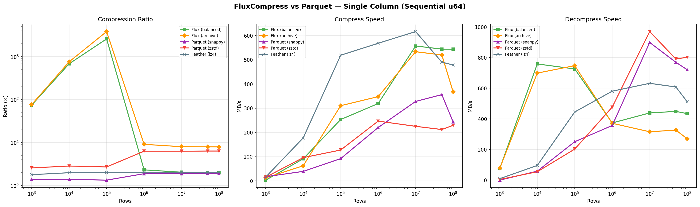
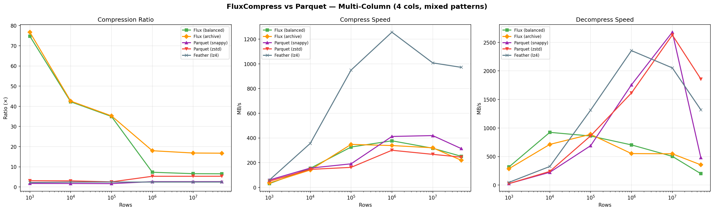

# FluxCompress

[](LICENSE)
[](https://www.rust-lang.org)

A high-performance, adaptive columnar storage format that **outperforms
Parquet** on compression ratio while matching or beating it on compress
throughput. Built in Rust with native `u128` support, composable secondary
compression, and Delta-Lake-style time travel.

### Why FluxCompress?

- **20% smaller** than Parquet Zstd on sequential data, **4× smaller** on multi-column
- **1.9× faster compress** than Parquet Zstd (native Rust, 100M rows)
- **Native u128** — no fixed-width waste for large aggregations
- **Adaptive** — detects data drift mid-stream and switches algorithms
- **Three profiles** — Speed, Balanced (LZ4), Archive (Zstd)
- **Time travel** — versioned tables with snapshot reads
- **Zero-copy** — Arrow FFI for Python, mmap for file reads

---

## Benchmarks (Native Rust — No Python Overhead)

All numbers from `fluxcapacitor bench`, measuring real file I/O through
Rust-native codepaths. FluxCompress uses mmap for decompression.

### 100M Rows — Single Column (Sequential u64, 763 MB raw)

| Format | Size | Ratio | Compress | Decompress |
|--------|------|-------|----------|------------|
| **Flux (archive)** | **97 MB** | **7.9×** | **395 MB/s** | 272 MB/s (mmap) |
| Parquet (zstd) | 121 MB | 6.3× | 212 MB/s | 584 MB/s |
| **Flux (balanced)** | 381 MB | 2.0× | **436 MB/s** | 322 MB/s (mmap) |
| Parquet (snappy) | 407 MB | 1.9× | 250 MB/s | 480 MB/s |
| Arrow IPC (raw) | 775 MB | 1.0× | 769 MB/s | 5,684 MB/s |

**Flux Archive: 20% smaller than Parquet Zstd, compresses 1.9× faster.**
**Flux Balanced: compresses 1.7× faster than Parquet Snappy.**

### 50M Rows — Multi-Column (4 cols, mixed patterns, 1.49 GB raw)

| Format | Size | Ratio | Compress | Decompress |
|--------|------|-------|----------|------------|
| **Flux (archive)** | **91 MB** | **16.7×** | 134 MB/s | 354 MB/s (mmap) |
| **Flux (balanced)** | **234 MB** | **6.5×** | 107 MB/s | 340 MB/s (mmap) |
| Parquet (zstd) | 368 MB | 4.1× | 240 MB/s | 623 MB/s |
| Parquet (snappy) | 577 MB | 2.6× | 265 MB/s | 270 MB/s |
| Arrow IPC (raw) | 1.51 GB | 1.0× | 595 MB/s | 2,078 MB/s |

**Flux Archive: 4× smaller than Parquet Zstd on real-world multi-column data.**

### TB Extrapolation (from 100M/50M asymptotic throughput)

**Single-column (1 TB raw = 125 billion u64 values):**

| Format | Est. Size | Compress | Decompress |
|--------|-----------|----------|------------|
| **Flux (archive)** | **127 GB** | **43 min** | 63 min |
| Parquet (zstd) | 159 GB | 81 min | 29 min |
| **Flux (balanced)** | 500 GB | **39 min** | 39 min |
| Parquet (snappy) | 533 GB | 68 min | 36 min |

**Multi-column (1 TB raw = 31B rows × 4 cols):**

| Format | Est. Size | Compress | Decompress |
|--------|-----------|----------|------------|
| **Flux (archive)** | **60 GB** | 2.1 hr | 47 min |
| **Flux (balanced)** | **153 GB** | 2.6 hr | 49 min |
| Parquet (zstd) | 244 GB | 1.2 hr | 27 min |
| Parquet (snappy) | 378 GB | 1.0 hr | 1.0 hr |

**Flux Archive compresses 1 TB of multi-column data to 60 GB — 4× smaller
than Parquet Zstd (244 GB). Parquet wins on decompress speed; Flux wins on
storage efficiency.**

### Scaling Charts (Python-based, 1K → 100M rows)

**Single-column:**



**Multi-column:**



### Run Benchmarks

```bash
# Native Rust (recommended — no Python overhead)
cargo run -p fluxcapacitor --release -- bench --rows 50000000 --pattern sequential

# Python scaling benchmark with charts
python python/tests/bench_scaling.py

# Quick ratio comparison (all patterns)
pytest python/tests/test_vs_parquet.py -v -s -k full_comparison_report
```

---

## Compression Profiles

| Profile | Secondary Codec | Best For |
|---------|----------------|----------|
| **Speed** | None | Real-time ingest, fastest decode |
| **Balanced** | LZ4 post-pass | General workloads, good ratio + speed |
| **Archive** | Zstd post-pass | Cold storage, maximum compression |

```python
buf = fc.compress(table, profile="archive")
```

```rust
let writer = FluxWriter::with_profile(CompressionProfile::Archive);
```

---

## Format v2

### File Layout

```
[Block 0][Block 1]...[Block N][Atlas Footer][block_count][footer_len][FLX2 magic]
```

### BlockMeta (60 bytes)

| Field | Size | Purpose |
|-------|------|---------|
| `block_offset` | 8B | Seek point |
| `z_min` / `z_max` | 16B each | Z-Order predicate pushdown |
| `null_bitmap_offset` | 8B | Null mask pointer |
| `strategy_mask` | 2B | Loom strategy ID |
| `value_count` | 4B | Rows in block |
| `column_id` | 2B | Multi-column support |
| `crc32` | 4B | Block integrity checksum |

### Adaptive Segmenter with Drift Detection

Geometric-stride probing grows segments up to 64K rows:

```
1. Probe 1024 rows → classify
2. Grow: stride 1024, 2048, 4096, 8192 (geometric)
3. If strategy changes → split (drift detected)
4. Cap at 65,536 rows
```

### The Loom Classifier

```
1. Entropy ≈ 0?       → RLE
2. Δ₁ constant?       → Delta-Delta
3. Cardinality < 5%?  → Dictionary
4. Numeric range?      → BitSlab + OutlierMap
5. Fallback            → SIMD-LZ4
```

### Native u128 + OutlierMap

- 99th-percentile slab width for the common case
- Full u128 precision for outliers via sentinel-based OutlierMap
- JNI dual-register bridge for Spark (`long[2]` → `u128`)
- **Parquet forces `FixedLenByteArray(16)` for every row** — FluxCompress doesn't

---

## Time Travel

Delta-Lake-style versioned tables:

```
my_table.fluxtable/
├── _flux_log/
│   ├── 00000000.json    # version 0
│   └── 00000001.json    # version 1
├── data/
│   └── part-0000.flux
└── _flux_meta.json
```

```rust
let table = FluxTable::open("my_table.fluxtable")?;
table.append(&data)?;
let snap = table.snapshot_at_version(0)?;  // time travel
```

---

## Getting Started

```bash
# Build & test
cargo build --release
cargo test --workspace

# Python
pip install maturin && maturin develop --release
pytest python/tests/ -v

# CLI
fluxcapacitor compress -i data.arrow -o output.flux
fluxcapacitor bench --rows 50000000 --pattern sequential
```

### Python

```python
import pyarrow as pa
import fluxcompress as fc

table = pa.table({"id": range(1_000_000)})
buf = fc.compress(table, profile="archive")
result = fc.decompress(buf, predicate=fc.col("id") > 500_000)
```

---

## Architecture

```
crates/
├── loom/              Core engine
│   ├── segmenter.rs   Adaptive segmenter + drift detection
│   ├── atlas.rs       v2 footer (60B BlockMeta, CRC32)
│   ├── txn/           Transaction log + time travel
│   ├── simd/          AVX2 / NEON / scalar unpackers
│   ├── compressors/   RLE, Delta, Dict, BitSlab, LZ4 + secondary
│   └── decompressors/ Block reader + mmap
├── jni-bridge/        Spark JNI (u128 dual-register)
├── python/            PyO3 bindings (Arrow FFI zero-copy)
└── fluxcapacitor/     CLI (bench, compress, inspect, optimize)
```

**Parallel by default** — Rayon across columns + segments. Arrow FFI for
zero-copy Python. mmap for file reads. u64 native extraction (no u128
widening until segment-level).

---

## Roadmap

- [docs/roadmap-performance.md](docs/roadmap-performance.md) — Performance optimization plan
- [docs/roadmap-wal.md](docs/roadmap-wal.md) — Binary WAL migration (v0.3–v0.5)

---

## License

Apache License 2.0 — see [LICENSE](LICENSE).
