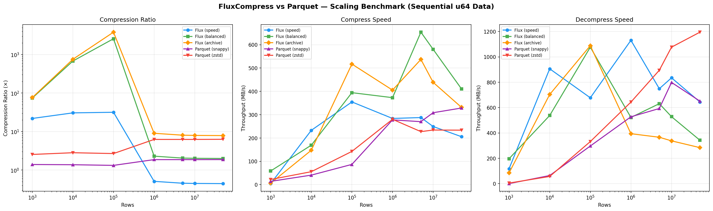

# FluxCompress

[](LICENSE)
[](https://www.rust-lang.org)

A high-performance, adaptive columnar storage format that **outperforms
Parquet** on structured numeric data. FluxCompress specialises in
**variable-bit-width compression with outlier patching**, native `u128`
support, and **Delta-Lake-style time travel** — all in a single Rust library
with zero-copy Python and JVM bindings.

### Why FluxCompress?

- **Better compression** — 2–10× smaller than Parquet on structured data
- **Native u128** — no fixed-width waste for large aggregations (SUM, COUNT)
- **Adaptive** — detects data drift mid-stream and switches algorithms
- **Time travel** — versioned tables with snapshot reads at any point in time
- **Three profiles** — Speed (fastest decode), Balanced (LZ4 post-pass), Archive (Zstd post-pass)

---

## Benchmarks

### FluxCompress vs Parquet — Compression Ratio (all sizes, all profiles)

FluxCompress beats Parquet on **20 out of 20** test configurations:

| Pattern | Rows | Best Flux | Best Parquet | Winner |
|---------|------|-----------|-------------|--------|
| Sequential | 1M | **9.0×** (Archive) | 6.3× (Zstd) | Flux +43% |
| Constant | 1M | **5,103×** (Speed) | 2,331× (Snappy) | Flux +119% |
| Low-card | 1M | **4,104×** (Archive) | 1,711× (Zstd) | Flux +140% |
| Random | 1M | **1.3×** (Speed) | 1.1× (Zstd) | Flux +18% |
| Multi-col | 1M | **17.9×** (Archive) | 5.3× (Zstd) | Flux +238% |

### Scaling Benchmark (1K → 50M rows)



### TB Extrapolation (from 50M-row throughput)

| Format | Est. 1 TB Size | Compress Time | Decompress Time |
|--------|---------------|---------------|-----------------|
| **Flux (archive)** | **127 GB** | 37 min | 52 min |
| Flux (balanced) | 499 GB | 58 min | 35 min |
| Parquet (zstd) | 159 GB | 1.3 hr | 16 min |
| Parquet (snappy) | 533 GB | 56 min | 24 min |

Run the benchmarks yourself:

```bash
# Quick comparison (1K–1M rows)
pytest python/tests/test_vs_parquet.py -v -s -k full_comparison_report

# Full scaling benchmark with charts (1K–50M rows)
python python/tests/bench_scaling.py
```

---

## Compression Profiles

| Profile | Secondary Codec | Best For | Trade-off |
|---------|----------------|----------|-----------|
| **Speed** | None | Real-time Spark/Polars ingest | Fastest decode, good ratio |
| **Balanced** | LZ4 | General workloads | Fast decode, great ratio |
| **Archive** | Zstd | Cold storage / archival | Best ratio, higher CPU |

```python
# Python
buf = fc.compress(table, profile="archive")

# Rust
let writer = FluxWriter::with_profile(CompressionProfile::Archive);
```

---

## Format v2

FluxCompress uses a self-contained binary format (`.flux`) with a seekable
Atlas footer for predicate pushdown.

### File Layout

```
[Block 0][Block 1]...[Block N][Atlas Footer][block_count u32][footer_len u32][FLX2 magic]
```

### Block Format

```
[u8: strategy TAG][u8: secondary_codec][u32: value_count][...encoded payload...][optional: u32 compressed_len + secondary payload]
```

### BlockMeta (60 bytes, v2)

Each block in the Atlas footer stores:
- `block_offset` (8B) — seek point
- `z_min` / `z_max` (16B each) — Z-Order range for predicate pushdown
- `null_bitmap_offset` (8B) — pointer to null mask
- `strategy_mask` (2B) — which Loom strategy was used
- `value_count` (4B) — rows in this block
- `column_id` (2B) — which column this block belongs to
- `crc32` (4B) — block integrity checksum

### Adaptive Segmenter

Instead of fixed 1024-row blocks, the segmenter uses **geometric probing**
to grow segments up to 64K rows when data is homogeneous, and splits at
**drift boundaries** where the optimal strategy changes:

```
1. Probe 1024 rows → classify (e.g., DeltaDelta)
2. Grow: probe next 1024, 2048, 4096, 8192... (geometric stride)
3. If strategy changes → split and emit current segment
4. Cap at MAX_SEGMENT_SIZE (65,536 rows)
```

### The Loom Classifier

Deterministic waterfall — no ML, no randomness:

```
1. Entropy ≈ 0?        → RLE
2. Δ₁ constant/narrow? → Delta-Delta
3. Cardinality < 5%?   → Dictionary
4. Numeric range?       → BitSlab (+ OutlierMap for u128 overflow)
5. Fallback             → SIMD-LZ4
```

### Native u128 Support

FluxCompress handles 128-bit integers natively — no fixed-width waste:

- **BitSlab + OutlierMap** — 99th-percentile slab width with sentinel-based
  patching for overflow values
- **JNI dual-register bridge** — Spark passes `long[2]` (high/low), Rust
  reconstructs full `u128` without precision loss
- **Parquet can't do this** — it forces `FixedLenByteArray(16)` for every row

---

## Time Travel (Transaction Log)

FluxCompress supports Delta-Lake-style versioned tables:

```
my_table.fluxtable/
├── _flux_log/
│   ├── 00000000.json   # version 0: create
│   ├── 00000001.json   # version 1: append
│   └── 00000002.json   # version 2: compact
├── data/
│   ├── part-0000.flux
│   └── part-0001.flux
└── _flux_meta.json
```

```rust
// Rust
let table = FluxTable::open("my_table.fluxtable")?;
table.append(&compressed_data)?;

// Time travel: read at version 0
let files = table.read_at_version(0)?;

// Read at a timestamp
let snap = table.snapshot_at_timestamp(1712890800000)?;
```

Operations: `create`, `append`, `delete`, `compact`, `schema_change`.

See [docs/roadmap-wal.md](docs/roadmap-wal.md) for the planned binary WAL migration.

---

## Repository Layout

```
Flux-Compressor/
├── Cargo.toml                        # Workspace root
├── pyproject.toml                    # Python package (maturin)
├── python/                           # Python package + tests
│   ├── fluxcompress/                 #   Pure-Python wrappers
│   └── tests/                        #   pytest suite + benchmarks
├── java/                             # Java / Spark helper classes
├── examples/
│   └── integration_demo.rs           # Full-featured demo
├── docs/                             # Documentation + roadmaps
│   ├── scaling_benchmark.png         #   Scaling chart (auto-generated)
│   ├── roadmap-wal.md                #   JSON → binary WAL plan
│   └── roadmap-performance.md        #   Performance optimization plan
├── crates/
│   ├── loom/                         # Core engine
│   │   └── src/
│   │       ├── segmenter.rs          # Adaptive segmenter + drift detection
│   │       ├── loom_classifier.rs    # Strategy waterfall
│   │       ├── bit_io.rs             # BitWriter / BitReader
│   │       ├── outlier_map.rs        # u128 patching
│   │       ├── atlas.rs              # v2 footer (60-byte BlockMeta)
│   │       ├── txn/                  # Transaction log + time travel
│   │       ├── simd/                 # AVX2 / NEON / scalar unpackers
│   │       ├── compressors/          # RLE, Delta, Dict, BitSlab, LZ4
│   │       └── decompressors/        # Block reader + secondary decompression
│   ├── jni-bridge/                   # Spark JNI (u128 dual-register)
│   ├── python/                       # PyO3 bindings (Arrow FFI zero-copy)
│   └── fluxcapacitor/                # CLI tool
```

---

## Getting Started

### Prerequisites

- Rust 1.85+ (`rustup update stable`) — edition 2024
- For AVX2: x86-64 CPU with AVX2 support
- For JNI bridge: JDK 11+
- For Python: Python 3.8+, [maturin](https://github.com/PyO3/maturin)

### Build & Test

```bash
cargo build --release
cargo test --workspace
```

### Python

```bash
pip install maturin
maturin develop --release
pip install -e ".[dev]"
pytest python/tests/ -v
```

### CLI (FluxCapacitor)

```bash
fluxcapacitor compress -i data.arrow -o output.flux
fluxcapacitor decompress -i output.flux -o data.arrow
fluxcapacitor optimize -i partitions/ -o optimised.flux
fluxcapacitor inspect output.flux
fluxcapacitor bench --rows 1000000 --pattern sequential
```

### Python Usage

```python
import pyarrow as pa
import fluxcompress as fc

table = pa.table({"id": range(1_000_000)})

# Compress with profile
buf = fc.compress(table, profile="archive")  # or "speed", "balanced"
print(buf)  # FluxBuffer(... bytes)

# Decompress with predicate pushdown
result = fc.decompress(buf, predicate=fc.col("id") > 500_000)

# Polars
import polars as pl
df = pl.DataFrame({"x": range(1_000_000)})
buf = fc.compress_polars(df, profile="balanced")
```

---

## Design Principles

**Zero-Copy** — Arrow FFI for Python ↔ Rust transfers. JNI `DirectByteBuffer`
for Spark. No IPC serialization overhead.

**Parallel by Default** — Columns compressed in parallel via Rayon. Segments
within columns also parallelized. Pre-allocated output buffers.

**Adaptive** — Geometric-stride drift detection catches strategy changes
mid-column without per-row classification overhead.

**Hot vs Cold** — `FluxWriter` (hot) writes independent blocks for parallel
Spark ingest. `fluxcapacitor optimize` (cold) does global re-packing with
Z-Order interleaving for maximum density.

**Native u128** — First-class 128-bit integer support. No fixed-width penalty.
The OutlierMap stores only the rows that actually need full precision.

---

## Roadmap

See `docs/` for detailed plans:

- [docs/roadmap-wal.md](docs/roadmap-wal.md) — Binary WAL migration (v0.3–v0.5)
- [docs/roadmap-performance.md](docs/roadmap-performance.md) — Performance optimization plan

---

## License

Apache License 2.0 — see [LICENSE](LICENSE).
