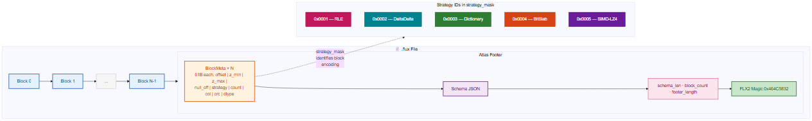

# .flux File Format

This document specifies the on-disk layout of `.flux` files produced by
FluxCompress.

---

## Overview

A `.flux` file is a sequence of **compressed data blocks** followed by a
**seekable Atlas footer**. The footer allows readers to locate and skip
blocks without reading the full file.



The last 4 bytes are always `0x46 0x4C 0x55 0x58` ("FLUX"). A reader locates
the footer by seeking to `EOF - 4`, reading `footer_length`, then seeking
back `footer_length` bytes.

---

## Atlas Footer (BlockMeta)

Each `BlockMeta` entry is exactly **50 bytes**:

| Field | Offset | Size | Type | Description |
|---|---|---|---|---|
| `block_offset` | 0 | 8 | `u64 LE` | Byte offset of block in the file |
| `z_min` (lo) | 8 | 8 | `u64 LE` | Low 64 bits of min Z-Order coordinate |
| `z_min` (hi) | 16 | 8 | `u64 LE` | High 64 bits |
| `z_max` (lo) | 24 | 8 | `u64 LE` | Low 64 bits of max Z-Order coordinate |
| `z_max` (hi) | 32 | 8 | `u64 LE` | High 64 bits |
| `null_bitmap_offset` | 40 | 8 | `u64 LE` | Offset of null bitmap (0 = none) |
| `strategy_mask` | 48 | 2 | `u16 LE` | Compression strategy ID |

**Strategy IDs:**

| ID | Strategy |
|---|---|
| `0x0001` | RLE |
| `0x0002` | DeltaDelta |
| `0x0003` | Dictionary |
| `0x0004` | BitSlab |
| `0x0005` | SIMD-LZ4 |

---

## Block Formats

### RLE Block (strategy `0x0001`)

```
[u8:  TAG = 0x01]
[u16 LE: run_count]
[run_count × (u128 value as 2×u64 LE, u16 LE length)]
```

### DeltaDelta Block (strategy `0x0002`)

```
[u8:  TAG = 0x02]
[u16 LE: value_count]
[u64+u64 LE: first_value (u128)]
[i64+i64 LE: first_delta (i128)]
[u8:  pack_width (bits per delta-delta value)]
[u32 LE: slab_byte_len]
[slab_byte_len bytes: packed delta-delta bitstream]
```

### Dictionary Block (strategy `0x0003`)

```
[u8:  TAG = 0x03]
[u16 LE: value_count]
[u16 LE: dict_size]
[dict_size × u128 (2×u64 LE): dictionary entries]
[u8:  index_width]
[u32 LE: slab_byte_len]
[slab_byte_len bytes: packed index bitstream]
```

### BitSlab Block (strategy `0x0004`)

```
[u8:  TAG = 0x04]
[u8:  slab_width (bits per value, 1–64)]
[u16 LE: value_count]
[u64+u64 LE: frame_of_reference (u128)]
[u32 LE: slab_byte_len]
[slab_byte_len bytes: primary packed bitstream]
[OutlierMap: see below]
```

**OutlierMap sub-format:**
```
[u32 LE: outlier_count]
[outlier_count × u128 (2×u64 LE): full-precision values]
```

A sentinel value of all-ones for `slab_width` bits in the primary slab
signals that the real value is stored as the next entry in the OutlierMap.

### SIMD-LZ4 Block (strategy `0x0005`)

```
[u8:  TAG = 0x05]
[u16 LE: value_count]
[u32 LE: uncompressed_byte_len]
[u32 LE: compressed_byte_len]
[compressed_byte_len bytes: LZ4 frame (lz4_flex prepend-size format)]
```

Uncompressed data is `value_count × 16` bytes of little-endian u128 values.

---

## Versioning

The current format version is implicitly **v1** (identified by the `FLUX`
magic).  Future versions will add a version field before the magic bytes and
maintain backward compatibility for reads.

---

## Endianness

All multi-byte integers are **little-endian**.

## Alignment

Bit-slabs are padded to a byte boundary. SIMD-friendly block sizes (64 KB –
1 MB) are recommended for the Hot Stream Model; the Cold optimizer may
produce larger blocks after Z-Order re-packing.
