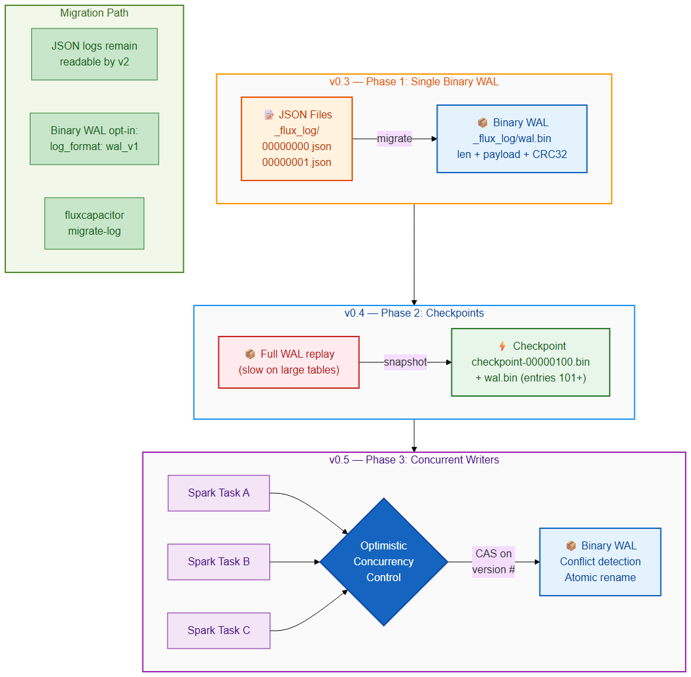

# Roadmap: JSON Transaction Log → Binary WAL



Status: Phases 1 & 2 implemented in `crates/loom/src/txn/wal.rs`.

- [x] **Phase 1 — binary append-only log** at `_flux_log/_wal.bin`
      with `[u32 len][payload][u32 CRC32]` framing.  Opt-in via
      `log_format = "wal_v1"` in `_flux_meta.json`.  Torn /
      CRC-corrupt tails stop replay cleanly so crashed writes never
      surface as phantom entries.
- [x] **Phase 2 — checkpoints** at `_flux_log/_checkpoint-NNNNNNNN.json`.
      `WalLog::latest_checkpoint_version` picks the newest and
      `read_checkpoint` hands back its JSON payload; readers then
      replay only the WAL tail past that version.
- [ ] **Phase 3 — concurrent writers** with OCC / `put_if_absent`.
      Deferred.

## Current State (v2)
The transaction log uses JSON files in `_flux_log/NNNNNNNN.json`. This is
human-readable and easy to debug, but has drawbacks at scale:
- Parsing overhead: `serde_json` is fast but not zero-copy
- File count: one file per transaction creates inode pressure on HDFS/S3
- No atomic multi-entry writes

## Planned: Binary Write-Ahead Log (WAL)

### Phase 1: Single binary log file
Replace the directory of JSON files with a single append-only binary file:
```
_flux_log/wal.bin
```

Layout:
```
[Entry 0: len(u32) + payload + CRC32]
[Entry 1: len(u32) + payload + CRC32]
...
[WAL Footer: entry_count(u64) + total_len(u64) + magic(u32)]
```

Each entry payload is MessagePack or FlatBuffers encoded (TBD).

### Phase 2: Checkpoint files
Periodically write a checkpoint that summarizes the state at version N,
so readers don't have to replay the entire WAL:
```
_flux_log/checkpoint-00000100.bin  # snapshot at version 100
_flux_log/wal.bin                  # entries 101+
```

### Phase 3: Concurrent writers
Support multiple Spark tasks writing to the same table simultaneously:
- Optimistic concurrency control (compare-and-swap on version number)
- Conflict detection via file-level locking or atomic rename
- Compatible with S3's eventual consistency model

### Migration Path
- JSON logs remain readable by v2 readers indefinitely
- Binary WAL is opt-in via a `_flux_meta.json` flag: `"log_format": "wal_v1"`
- `fluxcapacitor migrate-log` command converts JSON → binary WAL

### Dependencies
- `rmp-serde` or `flatbuffers` for binary serialization
- CRC32 for per-entry integrity (already in workspace)

### Timeline
- Phase 1: v0.3.0
- Phase 2: v0.4.0
- Phase 3: v0.5.0 (requires distributed testing infrastructure)
